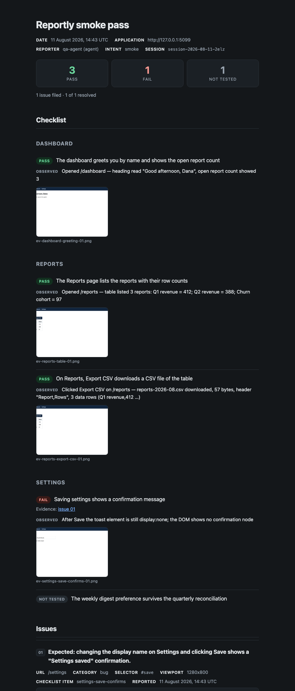

# sluglist

> Visual feedback that ends in a diff — for your dev loop, your client, your users, and an agent QA loop.

[](https://www.npmjs.com/package/sluglist)
[](LICENSE)
[](https://bundlejs.com/?q=sluglist)
[](https://www.npmjs.com/package/sluglist)

**[Live demo & docs → sluglist.dev](https://sluglist.dev)**

Anyone reports a bug on the running app — a client signing off a release, a tester, a customer in
production, or a QA agent driving a browser. It lands as **a folder of plain files**: `session.yaml`,
one markdown file per issue, the screenshot. A coding agent reads that folder, fixes the code, and
re-tests until the checklist is green — or says honestly which item it could not fix.

Underneath is a framework-agnostic, dependency-light widget: pick an element, grab an area or the full
page, annotate the screenshot, add a comment. The artifacts go to pluggable **connectors** — the core
knows nothing about where feedback is stored, and delivery is fully encapsulated in the connector you
provide. Alongside it, a CLI (`dev`, `report`, `status`, `init`) and four Claude Code skills that run
the loop end to end.

### Contents

**Start** · [Install](#install) · [Quick start](#quick-start) · [Pick your scenario](#pick-your-scenario)

**The loop** · [Local feedback loop](#local-feedback-loop) · [Let an agent fix it](#let-an-agent-fix-it-claude-code-skill) · [For agents](#for-agents) · [`sluglist init`](#set-the-project-up--npx-sluglist-init) · [`sluglist status`](#until-green--npx-sluglist-status) · [`PROJECT.md`](#project-conventions--sluglistprojectmd) · [Evidence-backed passes](#evidence-backed-passes) · [Headless writer](#headless-writer--sluglistnode)

**Capture** · [Modes](#capture-modes) · [Mobile](#mobile-graceful-mode) · [Form fields](#reporter-form-fields) · [Attachments](#attachments) · [Programmatic](#programmatic-capture) · [Identity](#attach-your-user)

**Delivery** · [Connectors](#connectors) · [Recipes](#connector-recipes) · [Reports](#reports)

**Real users** · [Beta mode](#beta-feedback-mode) · [Production](#production) · [Localization](#localization)

**Acceptance** · [Checklist mode](#checklist-mode) · [Five intents](#generate-a-checklist--five-intents)

**Reference** · [Artifact format](#artifact-format-contract) · [Metadata](#metadata-collected) · [Error capture](#error-capture) · [Action trail](#action-trail--record-mode) · [Notes & limits](#notes-and-limits)

## Install

```bash
npm install sluglist
```

## Quick start

One line of config. A connector, and nothing else:

```ts
import { createFeedbackWidget, mountFeedbackWidget, DownloadConnector } from "sluglist";

mountFeedbackWidget(createFeedbackWidget({ connectors: [new DownloadConnector()] }));
```

That is a complete, working widget: launcher, capture modes, annotation, error and action capture,
the offline outbox, a project slug derived from your hostname. **Everything else on this page is
optional** — presets, privacy, identity, form fields, attachments, checklists, localization. Add a
piece when you need it; none of them is a setup step.

Or without a build step at all (deps inlined, exposed as `Sluglist`):

```html
<script src="https://unpkg.com/sluglist"></script>
<script>
  const { createFeedbackWidget, mountFeedbackWidget, DownloadConnector } = Sluglist;
  mountFeedbackWidget(createFeedbackWidget({ connectors: [new DownloadConnector()] }));
</script>
```

Ships as ESM and CJS; `html-to-image` is loaded lazily on the first capture, so it is not part of your
initial bundle. Undelivered issues are persisted to IndexedDB and retried on the next load, so a failed
upload or a closed tab does not lose feedback.

## Pick your scenario

Four ways sluglist is actually used. Start from the one that matches you; each is a few lines, and the
details are one click away.

### 1 · Dev loop — you and an agent

Click feedback on your own app, have it land in a folder, let Claude Code fix it.

```ts
import { createFeedbackWidget, mountFeedbackWidget, LocalConnector } from "sluglist";

mountFeedbackWidget(createFeedbackWidget({ connectors: [new LocalConnector()] }));
```

```bash
npx sluglist dev        # sidecar that writes to ./.sluglist
```

Gate it behind an env flag so it never initializes in production —
`enabled: process.env.NODE_ENV !== "production"`.

→ [Local feedback loop](#local-feedback-loop) · [the fix skill](#let-an-agent-fix-it-claude-code-skill) ·
[capture modes](#capture-modes) · [record mode](#action-trail--record-mode) ·
[artifact format](#artifact-format-contract)

### 2 · Client acceptance — someone signs off a release

Put the build on staging with a **checklist** of what shipped. The client walks it, checks items off and
flags problems; you get a coverage map instead of a chat thread.

```ts
mountFeedbackWidget(
  createFeedbackWidget({
    project: "acme",
    connectors: [new HttpConnector("/api/feedback", () => token)],
    checklist: "/checklist.json",   // or an inline object
  })
);
```

When it's signed off, `npx sluglist report` turns the session into one self-contained HTML file you
can send back as proof — verdicts, notes and screenshots in a single attachment that opens offline.

→ [Checklist mode](#checklist-mode) · [generating one](#generate-a-checklist--five-intents) ·
[reports](#reports) · [connectors](#connectors) · [attachments](#attachments) ·
[localization](#localization)

### 3 · Beta / Production — real users report problems

A "Report a problem" button for people who are not your team: PII masked and scrubbed, a way to make the
widget go away, and delivery through an endpoint you own.

```ts
mountFeedbackWidget(
  createFeedbackWidget({
    project: "acme",
    preset: "production",
    connectors: [new HttpConnector("/api/feedback", () => session.token)],
    identity: { userId: user.id, email: user.email },
  })
);
```

→ [Production](#production) · [beta mode](#beta-feedback-mode) ·
[**production checklist**](docs/production-checklist.md) · [the endpoint](examples/feedback-route.ts) ·
[localization](#localization) · [mobile](#mobile-graceful-mode) · [attachments](#attachments)

### 4 · Agent to agent — the loop runs itself

A QA agent walks the checklist in a real browser and writes evidence-backed verdicts; a fix agent
answers them; a re-test round closes the loop. `sluglist status` decides whether another round is
worth running, so it stops on a genuine stall instead of grinding.

```bash
npx sluglist init --agents-md          # skills + PROJECT.md + .gitignore rules
# then, to your coding agent: "QA this branch and fix everything until it passes"
npx sluglist status --json             # green | continue | stalled | blocked
```

→ [For agents](#for-agents) · [until green](#until-green--npx-sluglist-status) ·
[project conventions](#project-conventions--sluglistprojectmd) · [the skills](skills/)

## Local feedback loop

Test your app locally, click feedback with the widget, and have it land in a `.sluglist/` folder in
your project — then let an agent (e.g. Claude Code) read it and fix the issues. Browser JS can't write
to disk, so a tiny sidecar process, `sluglist dev`, sits between the widget and the folder.

```ts
import { createFeedbackWidget, mountFeedbackWidget, LocalConnector } from "sluglist";

const widget = createFeedbackWidget({
  project: "my-app",
  connectors: [new LocalConnector()], // POSTs to http://127.0.0.1:4477 by default
});
mountFeedbackWidget(widget);
```

Gate it behind an env flag so it never initializes in production —
`enabled: process.env.NODE_ENV !== "production"`.

Run the sidecar next to your dev server:

```bash
npx sluglist dev                        # writes to ./.sluglist, port 4477
npx sluglist dev --dir .feedback --port 5511
```

Click feedback → the full artifact set appears under `.sluglist/session-*/`. The dev server binds to
`127.0.0.1` only and has **no authentication** — it is local-only by design; don't expose it or forward
its port. If it isn't running, `LocalConnector` warns once and your other connectors keep working (the
UI is never blocked).

> Add `.sluglist/` to your project's `.gitignore` — or let [`npx sluglist init`](#set-the-project-up--npx-sluglist-init) do it.

### Let an agent fix it (Claude Code skill)

The package ships a `sluglist-fix` skill that reads `.sluglist/` and fixes the reported issues. Set the
project up once:

```bash
npx sluglist init
```

That does the whole scaffold: `.sluglist/checklists/`, the `.gitignore` rules, every bundled skill in
`.claude/skills/`, and a `.sluglist/PROJECT.md` to fill in — see
[Set the project up](#set-the-project-up--npx-sluglist-init). Re-running it is safe: unchanged skills
are refreshed silently, and any you have edited are reported and left alone (`--force` replaces them).
`npx sluglist init-skills` installs only the skills.

<details>
<summary>or copy manually</summary>

```bash
mkdir -p .claude/skills && cp -r node_modules/sluglist/skills/sluglist-fix .claude/skills/
```

</details>

Then, after clicking feedback, ask Claude Code to "fix feedback": it reads each issue (comment,
selector, `element_text`, screenshot, `## Errors`), localizes and fixes the code, and writes a
`.done` report into the session folder. See [`skills/sluglist-fix/SKILL.md`](skills/sluglist-fix/SKILL.md).

`npx sluglist status` lists what is still open across the folder — issues with no record in
`fixes.yaml`, and anything a pass left as `wontfix` or `needs_info`.

## For agents

sluglist is also a protocol **between agents**: a dev agent generates the checklist, a QA agent with a
controlled browser walks it, a fix agent resolves what failed, and a re-test checklist closes the loop
— every hand-off is a sluglist artifact, so each role has evidence rather than another agent's word.

```
dev agent ──sluglist-checklist──▶ checklist.json
                                       │
QA agent (browser) ──sluglist-qa──▶ session/: session.yaml (verdicts) + NN-issue.md + NN-issue.png
                                       │
`npx sluglist status` ──▶ green | continue | stalled | blocked   ← the loop's decision point
                                       │  (continue)
fix agent ──sluglist-fix──▶ code commits + fixes.yaml (fixed | wontfix | needs_info)
                                       │
generator re-test mode ──▶ checklist.retest.json (only the fixed items, retest_of provenance)
                                       │
QA agent again ──▶ round 2 ──┐
                             └──▶ back to `sluglist status` until green, stalled or blocked
                                       │
`npx sluglist report` ──▶ report.html — one offline file for the human who paid for the work
```

Four skills ship in the package — one per stage, plus one that owns the cycle:

| Skill | Role |
|---|---|
| [`sluglist-loop`](skills/sluglist-loop/SKILL.md) | The orchestrator: picks the intent, runs the stages in order, carries the evidence mode, and — when you ask for it — keeps fixing and re-testing until green or genuinely stuck. Start here. |
| [`sluglist-checklist`](skills/sluglist-checklist/SKILL.md) | Generate or maintain a checklist: branch / re-test / smoke / regression / scenario. |
| [`sluglist-qa`](skills/sluglist-qa/SKILL.md) | Browser QA: no fail without a screenshot, no pass without performing the check. |
| [`sluglist-fix`](skills/sluglist-fix/SKILL.md) | Fix what failed + `fixes.yaml` (`fixed` \| `wontfix` \| `needs_info`). |

### Set the project up — `npx sluglist init`

One command, everything a project needs for the loop, idempotent:

```bash
npx sluglist init --agents-md
```

| It creates | Why |
|---|---|
| `.sluglist/checklists/` | Checklists are the committed spec — they live in the repo. |
| `.gitignore` rules | `.sluglist/*` ignored, with `checklists/` and `PROJECT.md` re-included: sessions stay local, the spec and the conventions are versioned. |
| `.claude/skills/*` | The four bundled skills (the `init-skills` step). |
| `.sluglist/PROJECT.md` | Your project's conventions — see below. |
| a "QA loop (sluglist)" section in `CLAUDE.md` / `AGENTS.md` | Only with `--agents-md`, and only if those files exist. |

Re-running reports what was already there and changes nothing. `--dir <path>` retargets the project
root. Two things are never overwritten: a skill you have edited (`--force` overrides), and
`.sluglist/PROJECT.md` — that one holds your answers, so **not even `--force` touches it**.

### Until green — `npx sluglist status`

Ask for a fix pass and the cycle repeats: QA finds failures, a fix agent resolves them, a re-test
round checks the fixes. The question that keeps the loop honest is *"is another round worth
running?"* — and an agent's own memory of what it just fixed is the wrong place to look it up.

```bash
npx sluglist status
```

```
.sluglist — 1 chain, 2 sessions

release-2026-08 · branch · 3 items
  1  session-2026-08-15-tw1w  1 pass · 1 fail · 1 not tested  ·  1 fixed
  2  session-2026-08-15-jtyf  0 pass · 1 fail · 0 not tested  ·  no fix pass yet

  still failing (1)
    csv-columns — for the next fix pass · failed in 2 rounds · issue 01
      "The CSV has every expected column"

  not tested (1) — email-receipt

verdict: stalled — 1 item failed in 2 or more rounds — a fix pass has already been tried
```

Everything is derived from the artifacts already on disk — the verdicts in `session.yaml`, the
resolutions in `fixes.yaml`, and the `retest_of` chain that links round 2 back to round 1. No new
file, no state to keep in sync.

| Verdict | Meaning | What the loop does |
|---|---|---|
| `green` | Nothing is failing | Stop; hand over the report. |
| `continue` | Failures a fix pass can still act on | Run another round, if the round budget allows. |
| `stalled` | Every remaining failure already survived a fix pass | Stop; hand the list to a human. |
| `blocked` | Everything left is `wontfix` / `needs_info` | Stop; those are the owner's calls. |
| `empty` | No sessions on disk | Nothing ran. |

`--json` gives an agent the same result as data (per-round counts, per-item `state`, `failed_rounds`,
the fix note); `--all` includes older chains instead of just the current one; a session folder as the
argument restricts the report to the chain containing it. It also works for the plain dev loop, where
the work items are the issues themselves rather than checklist verdicts.

The `sluglist-loop` skill reads this between rounds, and stops on `stalled` or `blocked` rather than
grinding the same item. **Its default ceiling is 3 QA rounds** — the first pass plus two fix→re-test
rounds — and `PROJECT.md` can change it.

### Project conventions — `.sluglist/PROJECT.md`

The skills ship with defaults, and editing a skill to fit your project stops it receiving upstream
improvements (`init` never overwrites an edited skill). So project specifics go in one committed file
instead, which every skill reads first:

- the **base branch** a `branch` diff runs against (`main` by default);
- **how to run the app** for QA — command, port, warm-up;
- **how to sign in** — referenced by env var or seed script, *never literal credentials*;
- **hard limits** — actions QA must never complete (live payments, real emails, external submissions);
- **evidence-mode defaults** per intent;
- **loop limits** — how many rounds the until-green loop may run, whether it may fix without asking,
  and what it does about commits;
- **environment quirks** — the flaky embed, the slow first paint, the route that 404s until a seed runs.

`npx sluglist init` writes the template; you fill it in. When it is absent the skills fall back to
their own defaults and say so once.

### Evidence-backed passes

By default only a `fail` carries evidence — its screenshot lives in the linked issue. Run the QA
skill in **evidence mode `all`** and every `pass` carries proof too: the screenshot taken at the
moment of the check, plus a note stating what was actually observed.

```ts
await session.setVerdict("reports-export-csv", "pass", {
  evidence: {
    screenshots: [pngBuffer],   // or a file path; several are allowed
    note: "Clicked Export CSV on /reports — reports-2026-08.csv downloaded, 57 bytes, 3 data rows",
  },
});
```

That note is the point. A screenshot proves *the screen looked like this*; it cannot prove *the
action worked*. For a download, a submission or a background job the skill requires the note to
carry the observable fact — the file's name and size, the toast's text, the counter that changed —
and treats a pass with nothing observable behind it as **not tested**. The result is a session, and
a [report](#reports), you can actually check rather than take on trust.

### Headless writer — `sluglist/node`

A Node-only subpath (no DOM, no browser code) with the widget's exact artifact semantics:
put-per-issue, put-per-verdict, the same `format_version`. Zero-config — one connector is a working
session:

```ts
import { createSession, LocalConnector } from "sluglist/node";

const session = await createSession({
  connectors: [new LocalConnector({ dir: ".sluglist" })], // writes straight to disk
  project: "my-app",
  baseUrl: "http://localhost:5173",
  checklist: "public/checklist.json",       // inline object, file path, or URL
  reporter: { name: "qa-agent", kind: "agent" },
});
```

File an issue with the agent's own browser screenshot:

```ts
const issue = await session.reportIssue({
  comment: "Expected: Export button on Reports. Observed: toolbar has only Print.",
  screenshot: pngBuffer,                    // Buffer | Uint8Array | Blob
  category: "bug",
  checklistItem: "export-button-visible",
  meta: { url: "/reports", viewport: "1280x800" },
});
```

Record verdicts, and (as the fix agent) resolution records:

```ts
await session.setVerdict("export-button-visible", "fail", { issue: issue.id });
await session.setVerdict("export-downloads-xlsx", "pass");

// fix agent, attached to the existing QA session folder:
const fixer = await createSession({
  connectors: [new LocalConnector({ dir: ".sluglist" })],
  sessionId: issue.sessionId,
  reporter: { name: "fix-agent", kind: "agent" },
});
await fixer.reportFix({ issue: issue.id, status: "fixed", commit: "a1b2c3d", note: "Null check added" });
```

Notes: `reporter.kind` is the only artifact difference from widget output (SPEC 1.5, additive).
Delivery uses the same per-connector retry rules; the one deliberate simplification vs the browser is
**no offline outbox** — a Node process inspects the returned report and retries itself. Every browser
connector that only uses `fetch` (e.g. an HTTP endpoint connector) works in Node 18+ unchanged.

## Attach your user

Three ways to know who reported something, and they are not interchangeable — the difference is *where
the value comes from*.

| | Source | When it is captured | Lands in |
| --- | --- | --- | --- |
| `identity` | your app already knows it | fixed at init | `reporter` in session.yaml + every issue |
| `setContext` | live host state (tenant, flags, build) | at capture time | `context` per issue |
| `form` | only the reporter can answer it | typed by them | `form` in session.yaml or per issue |

```ts
const widget = createFeedbackWidget({
  project: "acme",
  connectors: [/* … */],

  // 1. What you know: static, set once.
  identity: { userId: user.id, email: user.email, name: user.name },

  // 3. What only they know: asked in the panel.
  form: [
    { id: "email", label: "Your email", type: "email", scope: "session" },
    { id: "severity", label: "How bad is it?", type: "select",
      options: ["blocking", "annoying", "cosmetic"], required: true, scope: "issue" },
  ],
});

// 2. What changes while they use the app.
widget.setContext({ tenantId: "acme", featureFlags: "new-nav", buildVersion: APP_VERSION });
```

Reach for `identity` when you have the user object, `setContext` when the answer depends on where they
are in the app, and `form` when nobody but the person reporting can tell you (their email on an
anonymous beta, which account, how badly it hurts). Details:
[identity + custom](#beta-feedback-mode) · [setContext](#metadata-collected) · [form fields](#reporter-form-fields)

## Capture modes

- **fullpage** — the whole scrollable document
- **area** — drag a rectangle and crop to it
- **element** — hover to highlight, click to capture a single element (records its CSS selector)
- **comment only** — no screenshot

The menu lists them in that order (plus **Record steps**), most-used first, with `1`–`5` hotkeys
following the position.

Each screenshot can be annotated before sending (arrow, box, text; color; undo), with keyboard
shortcuts (A / B / T, Ctrl/Cmd+Z, Esc, click backdrop to close), and an issue can carry multiple
screenshots.

**When a screenshot fails, the issue still goes.** A render can die on the browser's terms — a webfont
that never resolves, a canvas the browser refuses to encode, a render that hangs. Any of those (plus a
render that comes back blank, and anything slower than 8s) is caught: the reporter sees a quiet
*"Screenshot failed — sending without it"*, keeps everything they typed, and the issue is delivered
comment-only carrying `screenshot_failed: true` and `screenshot_error: "<why>"` in its frontmatter. In
record mode a failed frame is skipped and the recording continues, with the gap marked in `## Actions`.
Nothing about a report is ever lost to a picture that would not render.

```ts
createFeedbackWidget({
  connectors: [/* … */],
  capture: { timeoutMs: 8000, detectBlank: true },  // defaults; both optional
});
```

Raise `timeoutMs` if you capture very long pages at high DPR.

## Mobile graceful mode

On a coarse pointer (detected from the pointer, not the user agent — a touch laptop keeps the full
desktop UI) sluglist **subtracts** rather than reimplements:

- The menu offers **full page** and **comment only**. Area mode needs a drag the browser spends on
  scrolling, and element mode is built on hover; both are hidden rather than offered and then failing.
- **Record mode is hidden.** Frames captured mid-scroll are unreadable; deferred rather than shipped bad.
- Panels go full-width, controls reach 44px, the textarea scrolls itself clear of the keyboard, inputs
  use 16px so iOS does not zoom in and strand the reporter, and the launcher clears the home indicator
  (`safe-area-inset-bottom`).
- Keyboard hints (the shortcut chips) are not shown to a device with no keyboard.

The checklist panel is fully usable on a phone; the per-item report button is always visible there
instead of hover-revealed.

## Reporter form fields

Ask the reporter what only they can tell you. Optional — with no `form` the panel is exactly what it was.

```ts
createFeedbackWidget({
  connectors: [/* … */],
  form: [
    // Asked once, on the first issue of the session → session.yaml
    { id: "email", label: "Your email", type: "email", scope: "session" },
    { id: "environment", label: "Device / browser", type: "text", scope: "session" },
    // Asked on every issue → that issue's frontmatter
    { id: "severity", label: "How bad is it?", type: "select",
      options: ["blocking", "annoying", "cosmetic"], required: true, scope: "issue" },
  ],
});
```

`type` is `text | email | select | checkbox`. `required` blocks sending and highlights the row; `email`
is pattern-checked; values are capped at 500 characters; at most 8 fields (invalid ones are dropped with
a warning, never breaking the widget).

```yaml
# session.yaml — the scope: "session" answers, asked once
form:
  email: "anna@client.com"
  environment: "iPhone Safari"

# NN-issue.md frontmatter — the scope: "issue" answers
form:
  severity: "blocking"
```

**Form values are never scrubbed**, even under the production preset. A reporter who types their address
into a field labelled *Your email* is telling it to you on purpose; redacting it would make the field
pointless. The scrub stays where it belongs — on text lifted off the page.

## Attachments

Let the reporter attach their own files: the screenshot they took on their phone, a console export, the
spreadsheet that is wrong. Three ways in, all going to the same place:

1. **+ Attach file** next to *+ Add screenshot*.
2. **Drag & drop** onto the open panel.
3. **Paste** (Cmd/Ctrl+V) — the one that matters most in practice, because a client's evidence usually
   arrives in their clipboard from a phone or an email.

Attached **images join the thumbnail row and annotate like any capture** — you can put arrows on their
screenshot. Everything else becomes a tile with its type, name and size, removable with the ✕.

```ts
createFeedbackWidget({
  connectors: [/* … */],
  attachments: {
    enabled: true,            // default true — but FALSE under preset: "production"
    maxFileSize: 10 * 1024 * 1024,
    maxFiles: 5,
    accept: [".log", "image/*"],   // optional: replaces the built-in whitelist
  },
});
```

Accepted by default: images (png, jpeg, webp, gif, heic), video (mp4, webm, mov), pdf, text (txt, csv,
json, md) and office (xlsx, docx). Checked on **both** the extension and the reported mime, so a renamed
binary is refused. **Executables and archives are never accepted** — not even through `accept`: an
archive is opaque to every check you and your storage run afterwards. Over the size or count limit, the
reporter gets a message naming the file and the actual limit; nothing is compressed or transcoded on the
client, so an oversized phone video is an honest error rather than a silent re-encode.

Files land next to the issue and are listed in its frontmatter. The reporter's own file name is never
used as a path — it is kept as data:

```yaml
attachments:
  - file: 03-checkout-att-01.png
    mime: image/png
    size: 482112
    original_name: "IMG_4021.png"
```

> **Attachments default to OFF under `preset: "production"`.** Accepting uploads from anonymous users is
> a decision, not a default. Turn it on with `attachments: { enabled: true }` when you have decided your
> endpoint can take it — and validate server-side regardless: see
> [`examples/feedback-route.ts`](examples/feedback-route.ts) (415 on an unlisted mime, 413 over the cap)
> and the [production checklist](docs/production-checklist.md).

## Connectors

A connector is the only place that knows about storage, auth and credentials.

```ts
interface ArtifactFile {
  path: string; // POSIX path inside the session folder, e.g. "01-broken-header.png"
  blob: Blob;
  mime: string; // "text/yaml" | "text/markdown" | "image/png"
}

interface FeedbackConnector {
  id: string; // used in logs and error reporting
  put(sessionId: string, file: ArtifactFile): Promise<void>;
}
```

Built in: `MemoryConnector` (accumulates in memory, for tests) and `DownloadConnector` (zips a
whole session via JSZip). Real targets (blob storage, an API route, a tracker) are your own
connector. `connectors` is an array, so one issue can fan out to several destinations at once;
a failing connector never blocks the others or the UI, and delivery retries with backoff.

### Connector recipes

Because the browser should never hold storage credentials, the recommended shape is a **thin
API route** on your side that takes the artifact and writes it server-side. The connector just
posts to it.

**Client connector (generic API route):**

```ts
class ApiRouteConnector implements FeedbackConnector {
  id = "api-route";
  constructor(private endpoint: string, private token: string) {}
  async put(sessionId: string, file: ArtifactFile) {
    const base64 = btoa(
      String.fromCharCode(...new Uint8Array(await file.blob.arrayBuffer()))
    );
    const res = await fetch(this.endpoint, {
      method: "POST",
      headers: { "content-type": "application/json", "x-feedback-token": this.token },
      body: JSON.stringify({ sessionId, path: file.path, mime: file.mime, base64 }),
    });
    if (!res.ok) throw new Error(`upload failed: ${res.status}`);
  }
}
```

**Server route — Vercel Blob** (`POST /api/feedback`):

```ts
import { put } from "@vercel/blob";

export async function POST(req: Request) {
  if (req.headers.get("x-feedback-token") !== process.env.FEEDBACK_TOKEN)
    return new Response("Unauthorized", { status: 401 });
  const { sessionId, path, mime, base64 } = await req.json();
  const bytes = Buffer.from(base64, "base64");
  const { url } = await put(`feedback/${sessionId}/${path}`, bytes, {
    access: "public",
    contentType: mime,
    addRandomSuffix: false,
  });
  return Response.json({ ok: true, url });
}
```

**Server route — S3 / R2** (same client connector):

```ts
import { PutObjectCommand, S3Client } from "@aws-sdk/client-s3";
const s3 = new S3Client({ region: process.env.AWS_REGION });

export async function POST(req: Request) {
  const { sessionId, path, mime, base64 } = await req.json();
  await s3.send(new PutObjectCommand({
    Bucket: process.env.FEEDBACK_BUCKET,
    Key: `feedback/${sessionId}/${path}`,
    Body: Buffer.from(base64, "base64"),
    ContentType: mime,
  }));
  return Response.json({ ok: true });
}
```

**Supabase Storage** (client-direct, with an insert-only RLS policy on the bucket):

```ts
import { createClient } from "@supabase/supabase-js";

class SupabaseConnector implements FeedbackConnector {
  id = "supabase";
  private sb = createClient(URL, ANON_KEY);
  async put(sessionId: string, file: ArtifactFile) {
    const { error } = await this.sb.storage
      .from("feedback")
      .upload(`${sessionId}/${file.path}`, file.blob, {
        contentType: file.mime,
        upsert: true, // session.yaml is re-written each issue
      });
    if (error) throw error;
  }
}
```

## Beta feedback mode

Beyond dev/staging, sluglist can power a **"Report a problem"** button for real users on a
production MVP or beta. It stays **one-way capture** (see the scope note below); the extra pieces are
reporter identity, per-issue custom fields, and PII masking so screenshots are safe to store.

```ts
import { createFeedbackWidget, mountFeedbackWidget } from "sluglist";
import { HttpConnector } from "./HttpConnector"; // see examples/

const widget = createFeedbackWidget({
  project: "acme",
  preset: "beta",                       // masks inputs + adds screenshot consent + "Report a problem" label
  connectors: [new HttpConnector("/api/feedback", () => currentUser.token)],
  identity: {                           // recorded once per session → reporter in artifacts
    userId: currentUser.id,
    email: currentUser.email,
    name: currentUser.name,
  },
  custom: {                             // flat project fields → custom block per issue
    plan: currentUser.plan,
    appVersion: APP_VERSION,
  },
  privacy: {                            // any explicit option overrides the preset
    maskSelectors: [".account-balance"],
  },
});

mountFeedbackWidget(widget);
```

Mark anything sensitive with `data-private` and it is always redacted in screenshots, regardless of
`maskInputs`. Values are masked only for the screenshot render; the live DOM is restored exactly.

**Delivery in production:** never ship storage write-keys in the browser. Post to a thin endpoint on
your side that owns the credentials and does the write (and rate-limiting). See
[`examples/feedback-route.ts`](examples/feedback-route.ts) (a ~50-line Next.js route handler) and
[`examples/HttpConnector.ts`](examples/HttpConnector.ts).

### Scope — one-way capture by design

sluglist captures feedback and hands it to your storage. It is **not** a support tool:

- **No inbox, no statuses, no threads, no replies to the user, no email notifications.**
- **No user accounts** and no login of its own.

If you need a support loop (triage, back-and-forth, resolution states), that is a different product;
sluglist deliberately stops at capture. Its output is a stable set of artifacts you can pipe into
whatever tracker or workflow you already run.

## Production

`preset: "production"` is `beta` plus the three things a widget needs once it faces paying
customers rather than your own testers: PII scrubbed out of the text it collects, a way for the
reporter to make it go away, and no `console.warn` capture.

```ts
const widget = createFeedbackWidget({
  project: "acme",
  preset: "production",
  connectors: [new HttpConnector("/api/feedback", () => session.token)],
});
const ui = mountFeedbackWidget(widget);
```

| | `dev` | `beta` | `production` |
| --- | --- | --- | --- |
| `privacy.maskInputs` | – | ✓ | ✓ |
| `privacy.screenshotConsent` | – | ✓ | ✓ |
| `privacy.scrubText` | – | – | ✓ |
| `errors.captureWarnings` | opt-in | opt-in | forced off |
| `dismiss.enabled` | – | – | ✓ |
| Button label | "Feedback" | "Report a problem" | "Report a problem" |

Every option can still be set explicitly and wins over the preset — except `errors.captureWarnings`
under `production`, which is forced to `false` (warnings are the noisiest text channel in a real
app; asking for them anyway logs a warning).

**Text scrubbing.** With `scrubText` on, the text surfaces of every artifact — `element_text`, the
issue `url`, each message and stack in `## Errors` (including failed-request paths), and the
selectors and labels in `## Actions` — have emails replaced by `[email]`, runs of 6+ digits by
`[digits]`, and hex/base64-shaped tokens by `[token]`. Dates, version numbers, viewport strings,
stack-trace line numbers and ordinary prose are left alone. Values *you* supply (`context`,
`custom`, `identity`, checklist titles) and the reporter's own comment are never scrubbed. Issues
carry `scrubbed: true` in their frontmatter so a reader knows which artifacts went through it.
`privacy: { scrubText: true }` also works without the preset.

**Dismiss.** The launcher gets a ✕ — shown on hover on desktop, always visible (muted) on touch.
Clicking it hides the widget completely, shortcut included, and remembers that for `dismiss.days`
(default 7; `0` means until storage is cleared). Configure with `dismiss: { enabled, days }`.

The rescue path is `ui.show()`, which clears the dismissal immediately. Wire it to a link in your
own footer so the ✕ is never a one-way door:

```ts
footerLink.addEventListener("click", () => ui.show());
```

**Self-isolation.** Everything the widget wraps (`console.error`, `fetch`, `XMLHttpRequest`,
`history.pushState`) calls the original host function unconditionally — a bug inside sluglist
cannot fail your request, swallow your log or block your navigation. Internal failures are counted;
after five in one session the widget uninstalls itself (originals restored by reference, listeners
removed, UI taken out of the DOM), logs one warning, and the page carries on without it.

**Zero phone-home:** the widget makes no network requests except to your configured connectors.
Enforced by an automated test ([`test/no-phone-home.test.ts`](test/no-phone-home.test.ts)) that
drives a full session with every outbound channel trapped and asserts the count is zero. Two
documented exceptions, both to URLs you already control: a `checklist:` URL if you configure one,
and — at capture time only — the page's own images and webfonts, which the DOM-to-PNG renderer
re-fetches in order to inline them into the screenshot.

Before pointing this at real users, work through
**[docs/production-checklist.md](docs/production-checklist.md)** — env gating, token generation,
retention, storage access, and a privacy-policy paragraph to adapt.

## Localization

Real users are the ones who need the widget in their own language, so this belongs with the beta and
production setup. Bundles ship for **en** (default), **ru**, **uk**, **es** and **de** — one line:

```ts
import { labels } from "sluglist/labels";

mountFeedbackWidget(widget, { strings: labels.uk });
```

Override a single string by spreading:

```ts
mountFeedbackWidget(widget, { strings: { ...labels.uk, send: "Полетіли" } });
```

Anything a bundle leaves out falls back to English, so an incomplete override can never leave a button
blank. The locale is **chosen by you, not sniffed from the browser** — which language your testers read
is a property of the engagement, not of their user agent.

Bundles translate widget chrome only. Your own copy — category chips, checklist titles, form labels — is
passed through config and stays yours to write.

**Plurals** go through the bundle's own rule, so Slavic languages get all three forms
(`1 кадр / 2 кадра / 5 кадров`, including the 11–14 exception) rather than a naive `n === 1` split. A
bundle declares its rule with `pluralForm`; if you write your own bundle for a language with three
forms, set `pluralForm: slavicPluralForm` (exported) and supply the `…Few` strings.

## Checklist mode

Everything above fills a session **from the bottom** — the client freely creates issues. A **checklist**
fills it **from the top**: the developer pre-seeds a list of "what shipped and what to verify", and the
client walks it with one natural motion — **click a row to check it off; click the slug button on a row to
flag a problem** (that opens the normal issue flow, linked back to the item). The panel is an accordion of
sections that self-navigates: finish a section and it collapses, opening the next one. A summary line
(`5 of 12 checked · 2 issues · 7 left`) replaces a bare counter, and the circle's badge counts what's left,
turning to ✓ when everything is checked. The result is a **coverage map** in `session.yaml`: what's
confirmed, what was flagged (with links to the issues), and what was never checked.

It's entirely opt-in: a second circle appears above the feedback button **only** when a checklist is
configured. Without one, the widget looks and works exactly as before.

```ts
const widget = createFeedbackWidget({
  project: "acme",
  connectors: [/* ... */],
  checklist: {
    id: "export-release-2026-07",
    title: "Export + notifications release",
    description: "Walk each item and check it off. Flag anything that looks wrong.",
    sections: [
      {
        title: "Export",
        items: [
          { id: "export-button", title: "On Reports, the Export button downloads a CSV", url: "/reports" },
          { id: "csv-columns", title: "The CSV has all the expected columns", hint: "Open it in a spreadsheet" },
          // Dynamic route: no fabricated id — a human hint + a wildcard match.
          { id: "assessment-header", title: "Opening any assessment shows the new header",
            hint: "Open the dashboard and pick any assessment", url: "/dashboard", url_match: "/assessments/*" },
        ],
      },
      { title: "Notifications", items: [{ id: "email-sent", title: "An email arrives after an export" }] },
    ],
  },
});
```

**Smart links.** `url` must be a **static** route — it renders as an "Open ↗" chip that navigates there.
For a **dynamic** route (an id/uuid in the path) don't guess an id: give a human `hint` and a wildcard
`url_match` (`"/assessments/*"`). It never navigates — it just lights the item up with a "You're here" tag
when the tester is on a matching page. The two can coexist (a list `url` + a detail `url_match`).

Pass a **URL string** instead of an object to fetch the checklist at init (`GET` → JSON of the same
shape) — handy when a skill generates it: `checklist: "/checklist.json"`. An unreachable or invalid
checklist warns and is skipped; capture still works.

Verdicts land in `session.yaml` (put-per-verdict, upserted on every click):

```yaml
checklist:
  id: export-release-2026-07
  title: "Export + notifications release"
  items:
    - id: export-button
      section: "Export"
      title: "On Reports, the Export button downloads a CSV"
      verdict: pass
      issue: null
      ts: 2026-07-24T14:05:10Z
    - id: csv-columns
      section: "Export"
      title: "The CSV has all the expected columns"
      verdict: fail
      issue: "03"          # the issue that documents the failure
      ts: 2026-07-24T14:06:00Z
    - id: email-sent
      section: "Notifications"
      title: "An email arrives after an export"
      verdict: null        # not checked
      issue: null
      ts: null
```

### Generate a checklist — five intents

The package ships a `sluglist-checklist` skill. Point Claude Code at a source and it writes a
client-facing checklist (user-visible pages/components/text only — refactors, tests and config are
excluded), grouped by feature and phrased for a non-developer:

| Intent | Built from | Ask for it with |
|---|---|---|
| `branch` | the branch diff vs its base | "generate a checklist from this branch" |
| `re-test` | a fixed session's `fixes.yaml` | "generate the re-test checklist" |
| `smoke` | the app's routes + docs | "generate a smoke checklist" |
| `regression` | the committed `regression.json`, updated from the branch diff | "update the regression checklist from this branch" |
| `scenario` | a written brief you give it | "checklist for the whole card-payment flow, including error cases" |

`regression` is the one with a **lifecycle**: it is a committed baseline at
`.sluglist/checklists/regression.json`, seeded once with the smoke algorithm and then updated
incrementally after each merge. Updates are a diff, not a regeneration — additions and removals are
proposed for you to confirm, the ~30-item cap is enforced by suggesting cuts rather than growing the
file, and unchanged item ids stay stable so verdicts recorded in past sessions still map to them.

By convention checklists live in **`.sluglist/checklists/<name>.json`** (`smoke.json`,
`regression.json`, `feature-export.json`…), and the intent is recorded in the checklist's `intent`
field so it travels into `session.yaml` and the report. Both consumers take a path:

```ts
createSession({ checklist: ".sluglist/checklists/smoke.json" });   // QA agent — local path
createFeedbackWidget({ checklist: "/checklists/smoke.json" });     // widget — fetched over HTTP
```

`sluglist dev` serves that folder read-only at `GET /checklists/<name>.json`, so the widget can load
one without copying it into your app's `public/`. See
[`skills/sluglist-checklist/SKILL.md`](skills/sluglist-checklist/SKILL.md).

### Scope — the checklist is a session input, verdicts are its output

The checklist enters a session and the verdicts leave with it. There is **no lifecycle beyond the
session**: items are never reopened, verdicts never sync between sessions, nothing is stored as a
"done on the server", and issues are never blocked on completing the checklist. Every session runs the
checklist from scratch. (This is deliberate — it keeps sluglist a capture tool, not a workflow tracker.)

## Reports

A session folder is the machine-readable truth, but it is not something you send a client. One
command turns it into a **single self-contained HTML file** — the proof artifact:

```bash
npx sluglist report
```

Zero config: with no arguments it takes the newest session in `.sluglist/` and writes `report.html`
next to it. Point it somewhere else when you need to:

```bash
npx sluglist report .sluglist/session-2026-08-11-2elz -o acceptance.html
```



What is in it, in order: the checklist title, date, application URL, reporter and intent; a summary
(N pass / N fail / N not tested, issues filed, how many are resolved); the checklist as an article,
each item with its verdict badge, its observed-fact note and its evidence thumbnails; then every
issue in full, with metadata, screenshots and its fix status from `fixes.yaml`; a footer naming the
artifact format version.

- **Offline and self-contained.** No stylesheet, script, font or image is fetched — CSS and JS are
  inlined, images are `data:` URIs. It opens from `file://` with the network off, and it survives
  being forwarded as one attachment.
- **Click a thumbnail** to open it full-size (a native `<dialog>`; the full image *is* the thumbnail,
  scaled by CSS, so nothing is stored twice).
- **Print → Save as PDF** gives a clean document — the print stylesheet drops the lightbox, lays the
  thumbnails out as a grid and forces a light theme.
- **Universal.** A session with no checklist renders as a plain list of issues.
- Screenshots are downscaled to 1200px and re-encoded before inlining, so a typical session
  (5 items, 6 screenshots) lands around 150 KB. This uses no image dependency at all — the PNG
  decoder and JPEG encoder are part of the CLI, so `npm install sluglist` still pulls **no native
  binaries** into your browser project.

## Programmatic capture

The UI is optional. Produce and deliver an issue without any chrome:

```ts
await widget.captureIssue({
  comment: "Logo overlaps the nav on narrow screens",
  mode: "element",
  selector: "header > nav .logo",
  screenshot: pngBlob,        // optional
  category: "bug",            // optional: bug | design | idea | ...
  consoleErrors: [...],       // optional, appended as a "## Console errors" section
});
```

Outside the browser, the same artifact semantics are available headlessly — see
[For agents](#for-agents) above.

## Artifact format (contract)

Delivered per session under `{project}/session-{YYYY-MM-DD}-{shortid}/`:

```
session.yaml            # upserted on every issue, always consistent
01-{slug}.md            # one markdown file per issue, YAML frontmatter + body
01-{slug}.png           # optional screenshot(s)
02-{slug}.md
...
```

`session.yaml` carries the environment (browser, OS, viewport, screen, DPR, language(s),
timezone, color scheme, reduced-motion) plus an index of issues. Each `NN-{slug}.md` repeats the
per-issue metadata in frontmatter followed by the free-text comment. The structure and frontmatter
are a stable contract intended as input for downstream parsers; **it only changes additively**.

The full field dictionary, section rules and versioning policy live in **[SPEC.md](SPEC.md)** — safe
to build parsers against. `session.yaml` starts with `format_version: "1.7"`; a missing version means
`"1.0"`. Within a major version, new fields are only ever added, never removed or repurposed.

## Metadata collected

Automatically, no personal data: URL path, viewport and screen size, device pixel ratio, browser
and OS (parsed from the user agent), UI language(s), timezone, color scheme, reduced-motion, and up
to the last 20 `console.error` messages. Deliberately not collected: full user agent, IP, cookies,
storage, geolocation, or any DOM content beyond the screenshot pixels.

Reporter **identity** and **custom** fields are collected only when you explicitly configure them
(see [Beta feedback mode](#beta-feedback-mode)); by default neither is present in the artifacts.

**Component hint (React).** In element mode, sluglist makes a best-effort read of the nearest named
React component from the element's fiber and records it as `component` in the frontmatter (e.g.
`component: AnimalCard`) — a strong localization hint for an agent. It needs no React dependency, is
fully guarded, and is `null` when React is absent, the component is anonymous, or names are minified in
production.

**Runtime context (`setContext`).** Attach live host state (tenant, feature flags, build version) to
every subsequent issue:

```ts
const widget = createFeedbackWidget({ project: "my-app", connectors: [/* … */] });
widget.setContext({ tenantId: "acme", featureFlags: "new-nav", buildVersion: APP_VERSION });
```

It lands as a `context` block in each issue's frontmatter. Same rules as `custom` (flat primitives,
snake_case keys, ≤ 20 keys, values clipped to 200 chars); repeat calls merge. Unlike `config.custom`
(fixed at init), `setContext` reflects state at capture time.

## Error capture

From the moment the widget initializes, sluglist keeps a small ring buffer of recent page errors from
four sources — `console.error`, uncaught `error` events, `unhandledrejection`, and **failed network
calls** — and attaches a snapshot to each issue as a `## Errors` section (with a relative timestamp per
entry) plus an `errors_count` field in the frontmatter. The original `console.error` still runs, so
nothing is swallowed.

Network capture wraps `fetch` and `XMLHttpRequest` and records **only** requests that finish with a
status ≥ 400 or a network error — method, path (no query), status and duration, never bodies, headers
or query strings:

```
## Errors
- [4s before report] network: POST /api/animals → 500 (240ms)
```

```ts
createFeedbackWidget({
  project: "my-app",
  connectors: [/* ... */],
  errors: {
    capture: true,          // default; set false to disable entirely
    bufferSize: 20,         // default
    captureWarnings: false, // default; true also captures console.warn
    captureNetwork: true,   // default; wrap fetch/XHR for failed-request facts
  },
});
```

> **Note:** error messages and stack traces can contain user data — in beta mode they may include PII.
> Production stack traces are usually minified. Treat captured errors as diagnostic hints, not ground
> truth; sluglist stores them verbatim and does not resolve source maps.

## Action trail & record mode

Some bugs need a sequence, not a single screenshot. sluglist has two layers for that.

**Action trail** (always on) keeps a small ring buffer of recent actions — clicks, SPA navigations,
submits, typing — and attaches them to every issue as a `## Actions` section (plus `actions_count`):

```markdown
## Actions
- [45s before report] navigate /animals → /animals/128
- [12s before report] click button[aria-label="Save"] ("Save")
- [11s before report] type (12 chars) input#email
- [10s before report] submit form[data-testid="animal-form"]
```

**PII rule (independent of any privacy setting):** the trail records the *fact and place* of an action,
never the entered content. `type` logs only a character count; password fields aren't logged at all by
default; navigation paths drop the query string.

**Record mode** turns a sequence into steps-to-reproduce *with images*. Click **Record steps**, do the
thing, then **Stop & describe**. A frame is captured at the start and on each click / navigation /
submit (not typing). Each Record→Stop cycle is one **clip**: its frames go to
`NN-slug-frames/clip-01/01.png …`, and the matching `## Actions` lines are tagged `— clip N, frame NN`.
Frames respect PII masking. Need a state the auto-capture misses (a hover popover, a transient toast)?
Hit **`+ Frame`** in the recording bar — or press **S** — to snap one manually.

Recordings and screenshots mix in one issue: start a recording from an open draft (via
`+ Add screenshot` → `Record steps`) and it attaches as a **new clip** instead of replacing anything.
Record twice and you get two independent clips — `clip-01/`, `clip-02/` — never one merged reel. In the
panel each clip shows as its own stacked tile (`Clip 1 · 5 frames`) with its first frame as the cover;
click it to expand the numbered ribbon, `×` to drop that clip alone.

```ts
createFeedbackWidget({
  project: "my-app",
  connectors: [/* ... */],
  actions: { capture: true, bufferSize: 30, capturePasswords: false }, // defaults
  recording: { enabled: true, maxFrames: 30, frameMinInterval: 650 },  // defaults
});
```

Deliberately **not** built: session replay (rrweb), real video (`getDisplayMedia`/`MediaRecorder`), or
network capture. The output is artifacts for an agent to read, not a replay a human scrubs.

## Notes and limits

Measured in Chromium 151, Firefox 153 and WebKit 26.5 (the Safari engine) against a page built out of
known DOM-to-canvas failure modes. The full matrix is in [RUN_EVIDENCE.md](RUN_EVIDENCE.md).

**Renders correctly in all three engines:** webfonts, emoji, CSS `filter`, gradients, `position: fixed`,
long full-page captures, cross-origin images served with CORS headers, and the annotation round-trip.

**Known limits — not fixable from here:**

- **`backdrop-filter` is not rendered** in any engine. The blur is dropped and the element paints as if
  it had none. Nothing in the DOM-to-canvas approach can reproduce it, since it depends on what is
  painted *behind* the element.
- **Cross-origin images served without `access-control-allow-origin` come out blank.** The renderer has
  to re-fetch them to inline them, and the browser will not hand over pixels it cannot read. The rest of
  the page still captures — before this iteration one such image failed the entire screenshot.
- **WebGL, `<canvas>` and video content** do not render.
- Elements parked by scroll-reveal animations are temporarily revealed during capture and restored.

**Mobile** is [graceful degradation, not a mobile UI](#mobile-graceful-mode): full page and comment-only,
no element/area/record on touch.

Style isolation via shadow DOM; nothing leaks in or out of the host page.

## License

MIT (c) Yelysei Lukin / MiraWision
